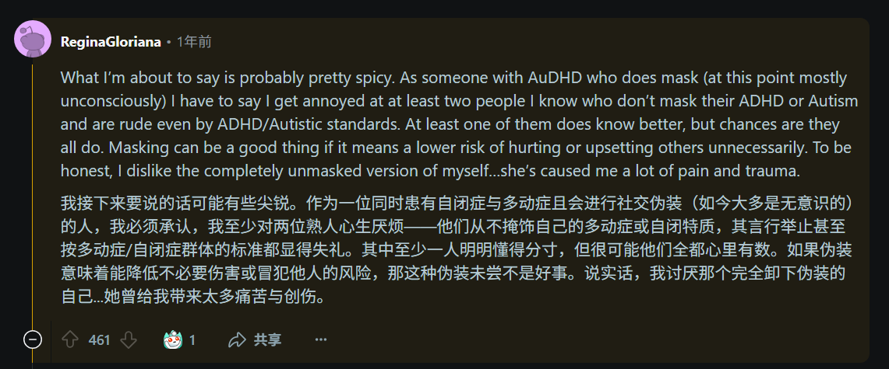

刚才在看 Russell Barkley[^1] 对纽约时报一篇文章的回应视频[^2]

澄清了一些大众对 ADHD 的误解，看下来感觉还不错

在 r/ADHD 中搜索 Russell Barkley 并浏览相关帖子时，发现了这条评论[^3]

相关视频是 Masking and Adult ADHD[^4]

和我的观点差不多，我并不认为 masking 是完全不好的行为

无论是否为 ASD/ADHD，masking 都是我们在进行社交时所需要做的，只是对于我们而言，可能会更加困难和痛苦一些

人与人的接触，需要把控好距离，不伤害自己，不伤害他人

如果所谓真实的自己，会对他人造成伤害，应尽可能避免

即使自己难以做到，也应当建立起交流，而不是将其视为理所当然

合理化对他人的伤害，我感觉不太合适

并非是为了表现得更像所谓的正常人，只是对他人的友善

基于同理心，尽力避免对他人（以及自己）造成伤害，至少尽力避免不必要的伤害

如有余力，让他人感觉更好一些（前提是保护好自己）

---

[^1]: https://www.youtube.com/@russellbarkleyphd2023

[^2]: https://www.youtube.com/watch?v=-8GlhCmdkOw&list=PLKF2Eq0eYbbq_Q0CWlrq_yGMTEqQMkxa2

[^3]: https://www.reddit.com/r/ADHD/comments/1ec07xe/comment/lewwjsr/?utm_source=share&utm_medium=web3x&utm_name=web3xcss&utm_term=1&utm_content=share_button

[^4]: https://www.youtube.com/watch?v=q9Ua8ef-pUw