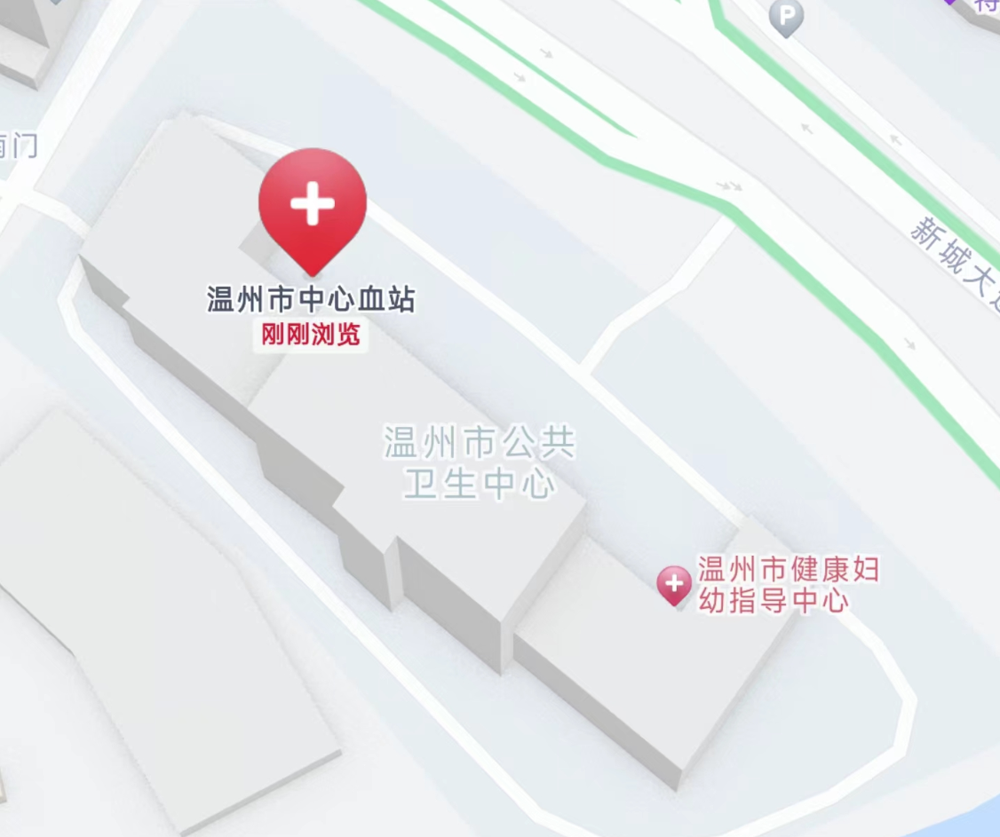

记录第一次个人进行献血

<!-- truncate -->

之前都是由学校组织的，毕业后就只能自己找地方献血了，这次在浙江温州市中心血站进行的一次献血，全血 400ml，下文包括献血前的准备，和具体的献血流程

## 献血前准备

### 查询献血地点

以浙江温州为例

1. 在支付宝搜索浙江献血，进入 `浙江献血` 小程序

   

2. 点击 `献血导航`，选择自己所在城市，根据距离和时间选择献血地点，我这里选择的是温州市中心血站

   

### 注意事项

献血前要注意以下几点：

- 献血前不可服用药物、饮酒、吃油腻食物
- 前一天要早睡、当天早上要吃早饭
- 携带身份证
- 带着手机、要扫码进行网上填表

另外

- 冬天献血注意保暖，手太冷会影响献血前的采血体检
- 注意不要去的太晚，避免在午饭或晚饭时间空腹献血
- 记一下自己的体重，医生会询问

### 手册

具体可以参考下面的手册

## 献血流程

以我本次在温州市中心血站的献血为例

早上吃完早饭之后，乘坐交通工具来到温州市中心血站（在温州市公共卫生中心内部，不要以为走错了，看一下门牌号是新城大道 41 号就对了）

在门卫处完成登记（此时也可以让门卫帮忙指路），去右侧的入口

在一楼右转，进门找到医生，说自己是来献血的。医生会让你扫码填表，其实就是上面小程序里的 `浙江献血 > 我要献血 > 网上填表`

填完表格之后，把身份证给医生，跟着到一个房间进行健康征询体检，医生让你把右手放进测血压的机器，然后问你几个问题，比如：

- 体重多少斤
- 昨天晚上几点钟睡的觉
- 早饭吃的什么，几点钟吃的

一切正常之后就可以接过单子，按照要求进行签字

签完字之后会换到另外一个房间进行初筛，在手背取血进行检测，检测正常之后开始正式献血

献血前医生会给你一杯温糖水，喝下后坐在沙发上等待开始献血

医生会询问要献多少血（200ml、300ml、400ml），我这里选择的是 400ml

在扎入针管，开始献血之后，按照医生的要求，持续缓慢地握紧、松开献血那条胳膊的手掌

大概二三十分钟后，献血完成，医生拔下针管，贴上创可贴，绑上弹性绷带，并告知献血后注意：

- 弹性绷带 1 小时后解除，创可贴需要至少 4 小时后才可以撕下，在这段时间内不要用献血的手提重物
- 之后 24 小时不要进行剧烈运动，也不要让伤口沾水，注意正常饮食、保持充足睡眠
- 献完血之后可以休息一段时间再离开

离开前医生会让你在纪念品领取表上签名，并带上纪念品（物品每次都不太一样，我分别拿到过毛绒玩偶、收音机和毛毯，除此之外会有一本手册、一盒椰汁，一起装在袋子里）

之后可以在浙江献血小程序中查询电子献血证，可以看到自己的血型、献血量等等

## 后记

献全血的话，两次献血需要间隔半年，这次冬天去献血，太冷了，而且按照半年的间隔，下次是夏天，又太热了，打算多等一段时间，卡在春秋去献，应该会好很多
