[片轮少女（Katawa Shoujo）](https://www.katawa-shoujo.com/) 是一个来自 4chan 论坛的 galgame，具体介绍可以看B站UP主 [BB姬Studio](https://space.bilibili.com/96575424) 的视频：「[我在9年前汉化的“传奇”美少女游戏，今天终于登上了Steam](https://www.bilibili.com/video/BV1ExpMeBEmw/)」，视频文案作者怪物马戏团是当初汉化组的成员

<!-- truncate -->

## 游玩注意

下面的内容主要是给像我一样之前没接触过正经 galgame 的玩家提供一些说明，可以选择直接跳过

### 本体下载

已上架 Steam，搜索 Katawa Shoujo 即可，也可在其 [官网下载页面](https://www.katawa-shoujo.com/download) 下载

### 汉化补丁

在 Steam 中，找到 Katawa Shoujo 的讨论区，置顶的主题 _Steam Version Additional Language Patches_ 中，包含简体中文汉化补丁的下载链接

> [简体中文 / Simplified Chinese](https://0x0.st/XvZG.rpa/lang-zh.rpa)

使用方法参考主题中的介绍：

> Instructions:
>
> 1. Download a patch file below.
>
> 2. Navigate to your Steam folder and copy the downloaded file to the folder "Katawa Shoujo/game/".

将补丁包放在 Steam 的 `Katawa Shoujo/game/` 目录下即可，以 SteamLibrary 在D盘为例，目录为 `D:\SteamLibrary\steamapps\common\Katawa Shoujo\game`

### R18 补丁

在 [官网下载页面](https://www.katawa-shoujo.com/download) 最下方，_R18 Steam Patch_ 一节中，有提供给 Steam 版本的 R18 补丁，参照指示，将下载到的 `r18.rpa` 文件放在和汉化补丁一样的目录下即可

另外，第一章没有 R18 内容，我也不知道补丁中包含了什么内容，不过为了防止有遗漏的剧情，最好还是都加上

### 切换中文

初次进入游戏时，界面为英语，在打好汉化补丁之后，依次选择 _Options > Language selection > 简体中文（Chinese）_ 即可切换到中文

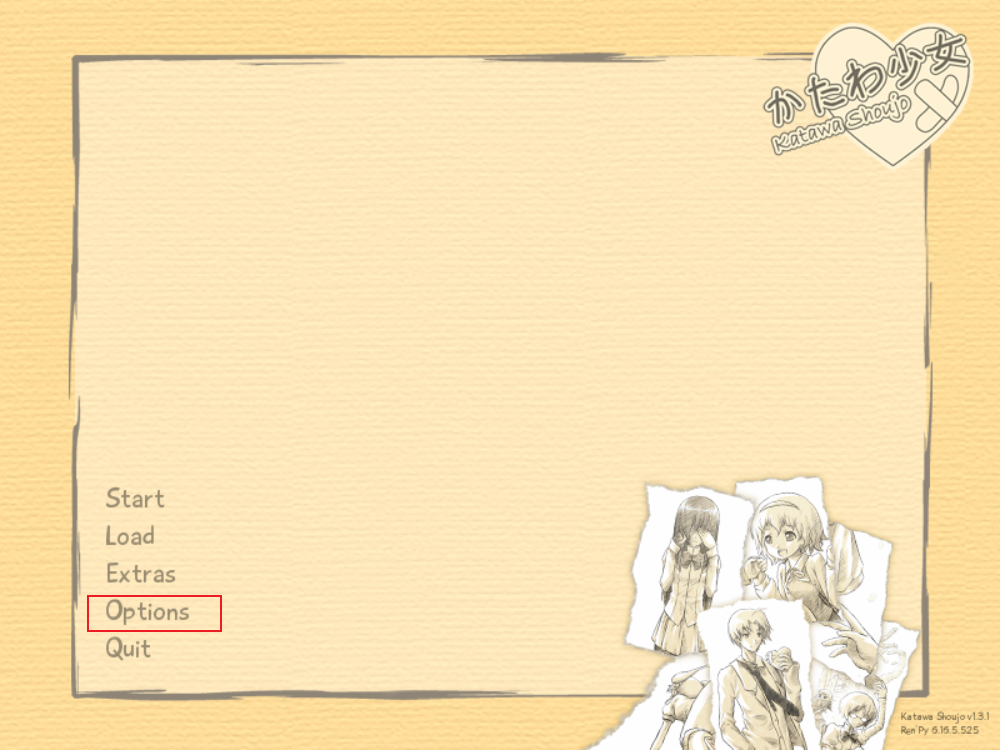

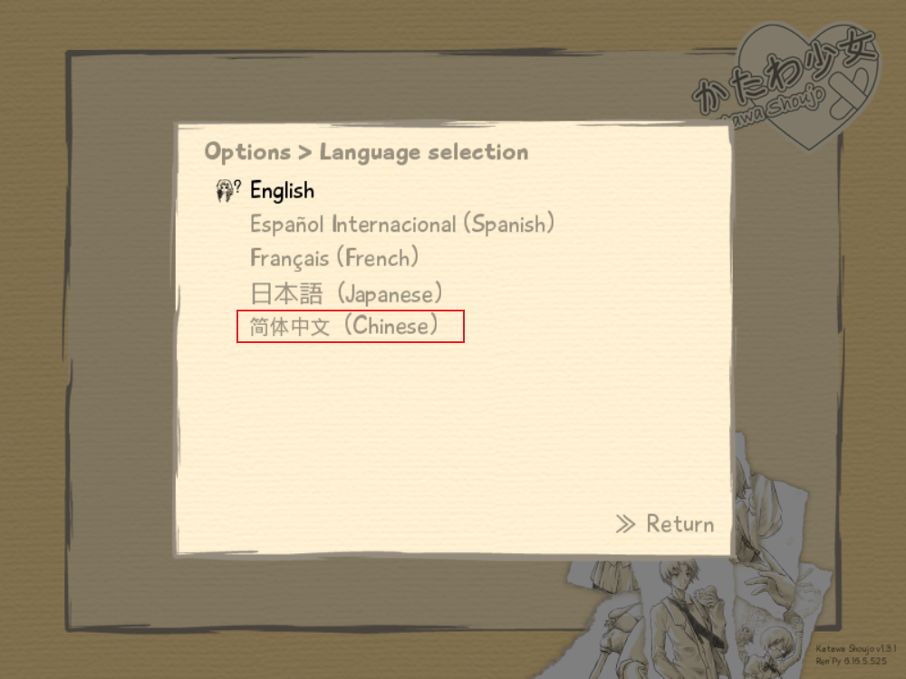

### 操作

#### 主菜单

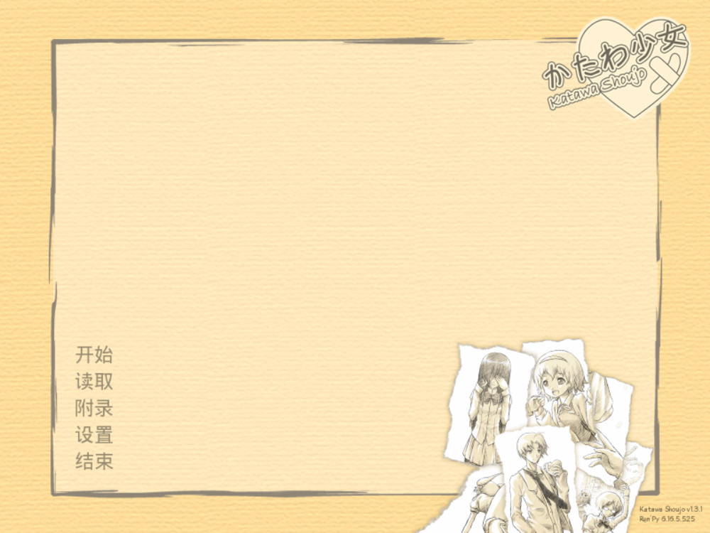

没有存档的话，直接点击 `开始` 开启一段新的剧情，然后去看下文的 [游戏内界面](#游戏内界面) 介绍

点击 `读取` 来选择并进入之前的存档

在 `附录` 中查看已解锁的音乐、图片、剧情和动画

`设置` 呼出设置界面，可以参考我设置的自动模式速度，里面的其他几个选项基本都是字面意思

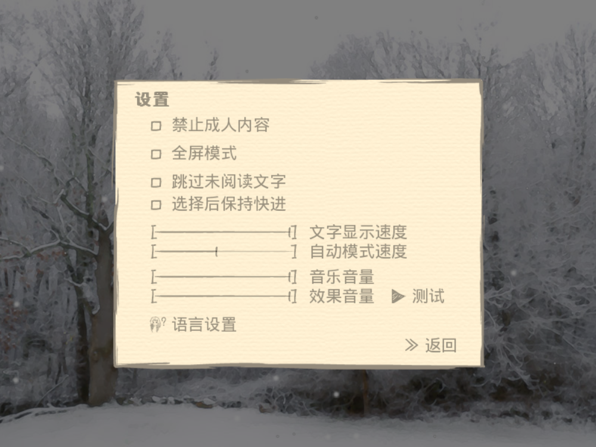

点击 `结束` 退出游戏

#### 游戏内界面

点击 `开始` 进入游戏，游戏界面比我玩过的其他 galgame 要简单很多（虽然我也只玩过 _Doki Doki Literature Club_ 和 _Revue Starlight El Dorado_）

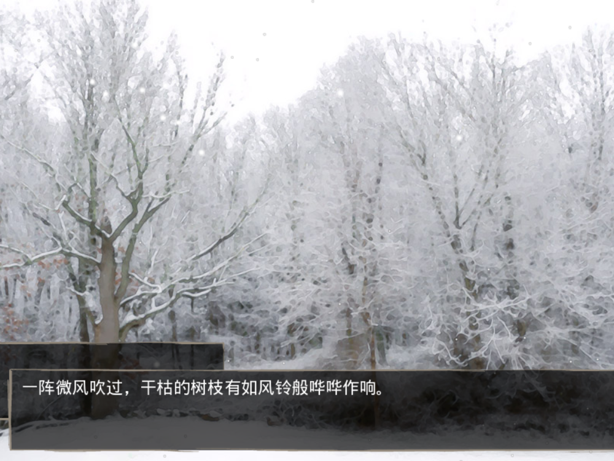

按空格或者点击鼠标左键来阅读下一段文字，Esc 或鼠标右键呼出游戏内菜单

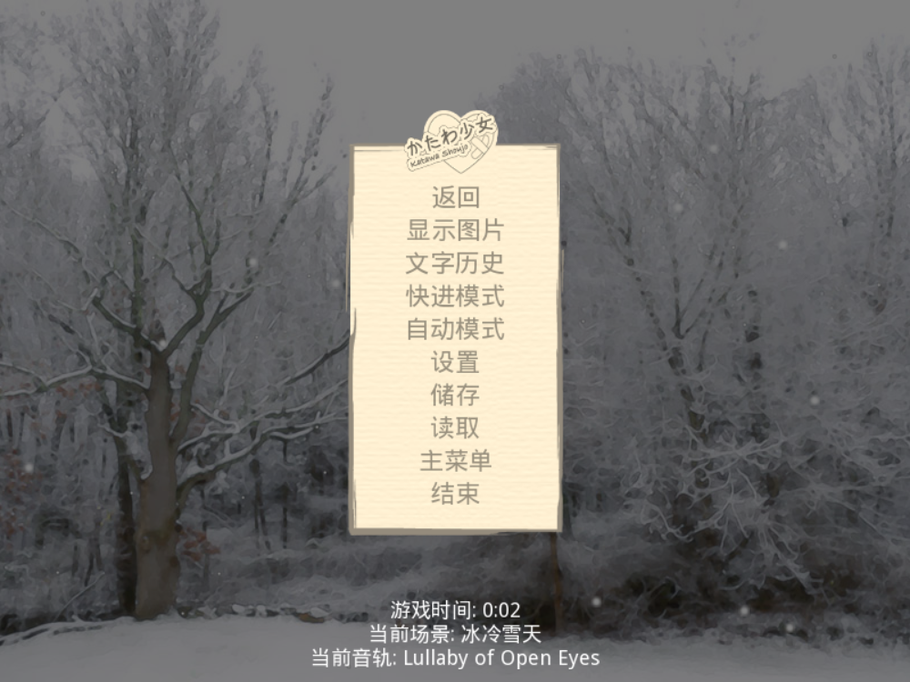

其中 `快进模式` 用来快进到下一个选择，没有存档的话经常用

`自动模式` 会自动播放剧情，可以省去按空格键的动作，不过自动模式播放速度需要自己调整一下，尽量与阅读速度同步

`设置` 可以呼出设置界面，更改能即时生效

`储存` 和 `读取` 是存档相关的，遇到选择时最好存档一下，之后可以读取存档，来看另外一个选择的剧情

`主菜单` 会返回游戏主菜单，`结束` 会直接退出游戏，注意要先存档，不然进度会直接丢失

### 剧情分支

目前我只玩了第一章，根据你在第一章内的选择，游戏会走到不同的人物线，具体逻辑可以参考我在贴吧找到的两张图，没有翻译，不过基本能看懂

**第一章剧情分支：**

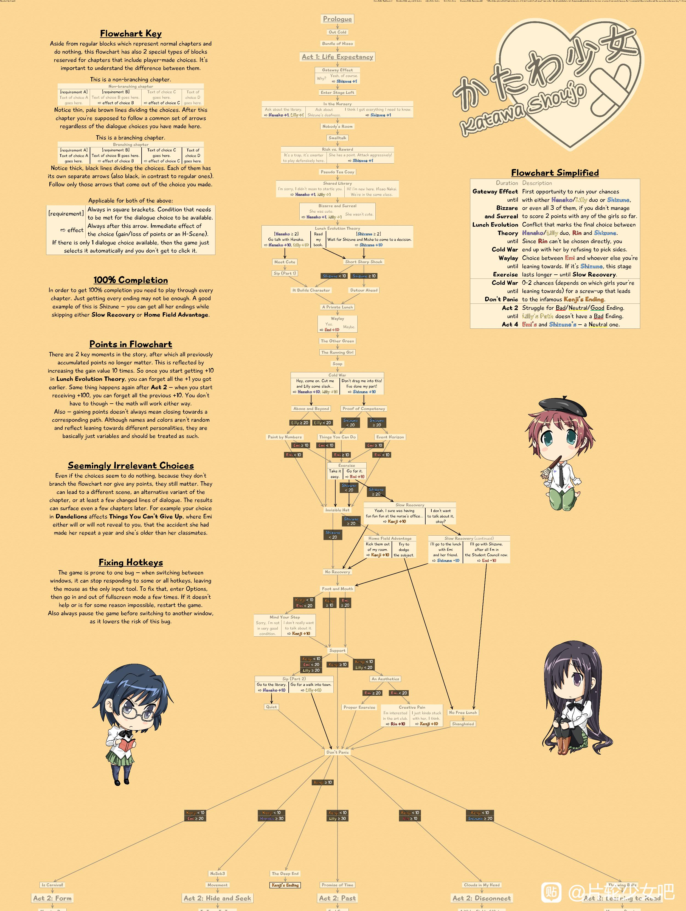

**后续剧情分支：**

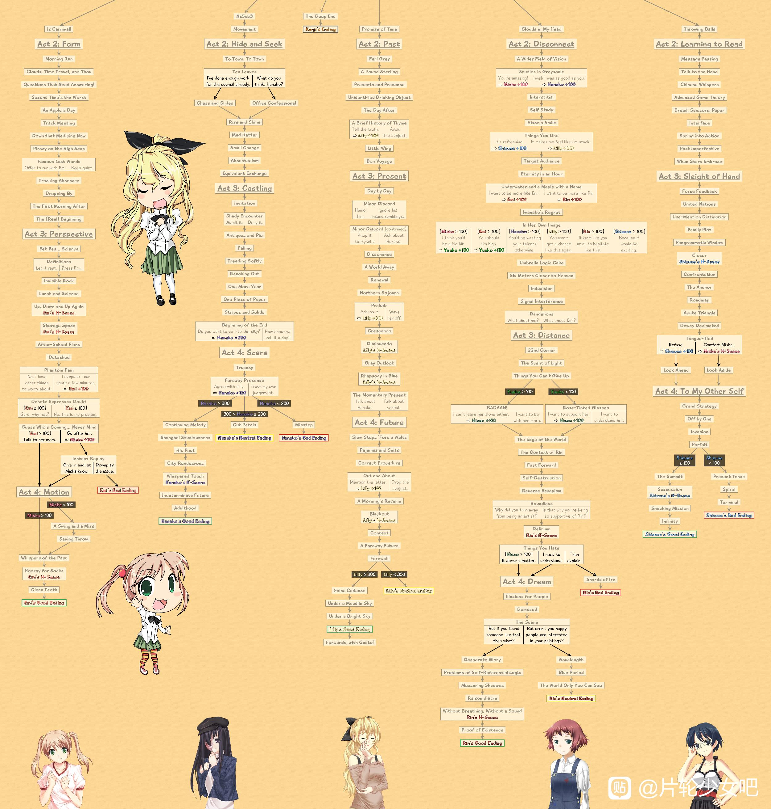

## 个人体验

> **注意：可能存在剧透**

第一次游玩，我甚至都没用存档功能，按照自己的想法选择之后，进了笑美线，回想一下可能是我太注重健康了，一直坚持和医生的约定去晨跑，后来我放弃了晨跑，才终于进了琳线

不过我想在开始后续剧情前，先把第一章的所有分支都看一遍，所以又回过头去，把每一个分支都走了一遍

静音线是最后解锁的，甚至还是去贴吧找了攻略之后才知道如何解锁，可能是因为我每次面对进攻和防守的选择时，都会想着不要犯左倾错误

不过静音线的动画倒是引起了我的兴趣，频繁出现的三角暗示，还有这张经典构图

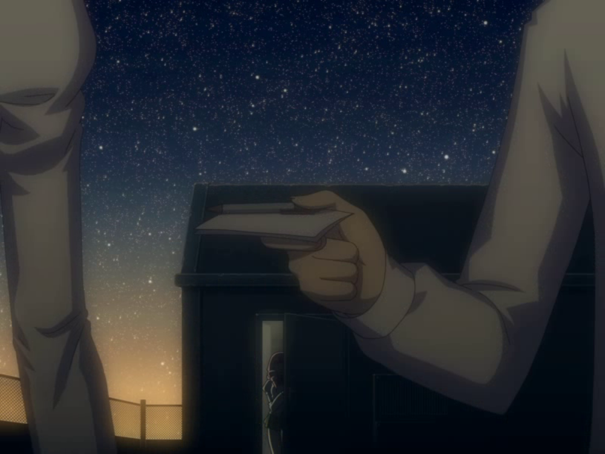

相当于静音半身的米莎，作为静音与外界唯一沟通桥梁的米莎，看似永远积极乐观的米莎，被静音无法离开地依赖着，但我更愿意相信反而是米莎无法离开静音

有了男主的参与之后，班级里有了第二个会用手语和静音沟通的人，米莎是不是就会变成“这个，不需要了”呢，虽然这是一个 bg 向的 galgame，但我希望写静音线的作者能多掺一点女女关系性进去

当然，我最喜欢的还是琳，看BB姬的视频时，就更关心琳一些，看完了第一章之后，最喜欢的还是琳，无论是角色本身的形象、剧情，还是相关的图片和动画，在我这里，都是美学上更符合我兴趣的一方

特别是琳的立绘，每个表情都很生动，而且形象完全就像是从剧情中走出来的一样，或者应该反过来说，剧情正是琳所会做的

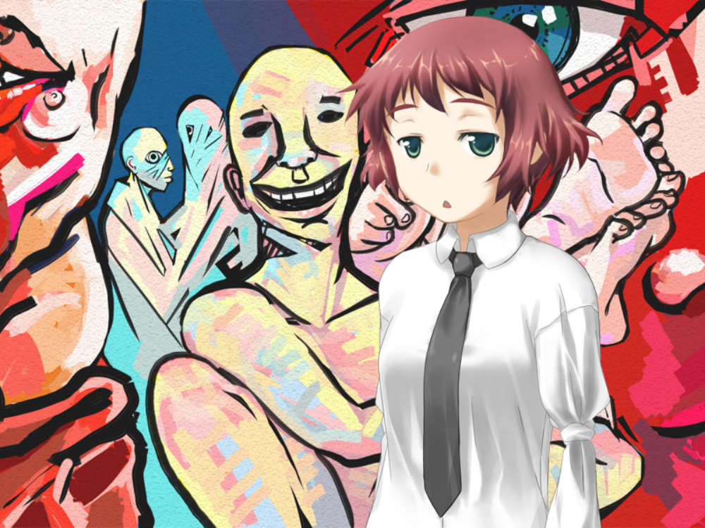

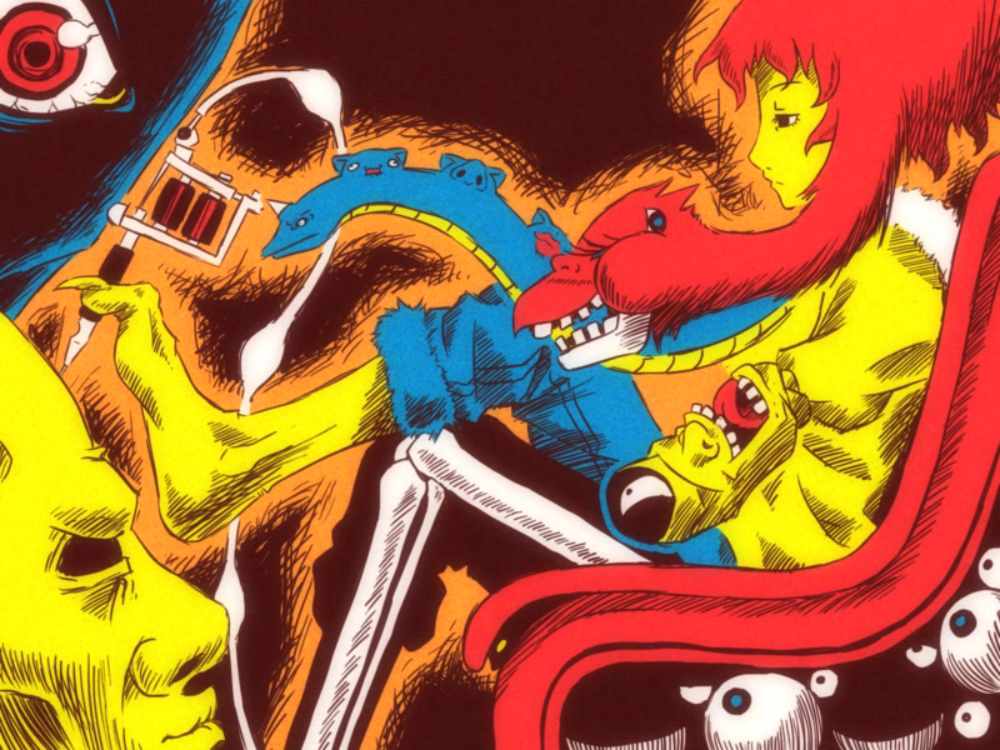

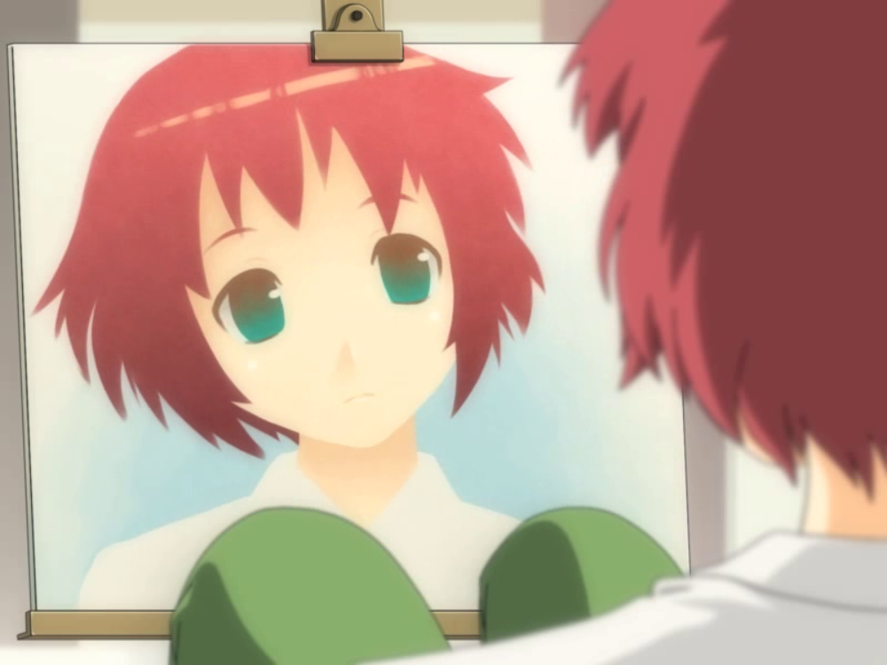
