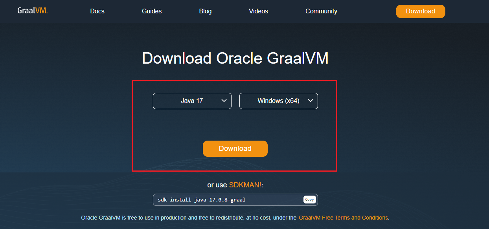
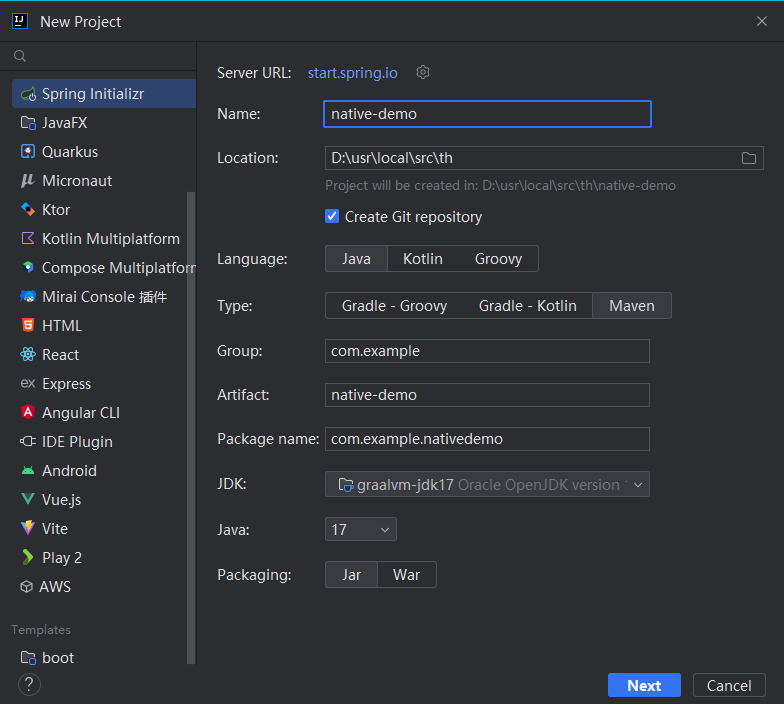
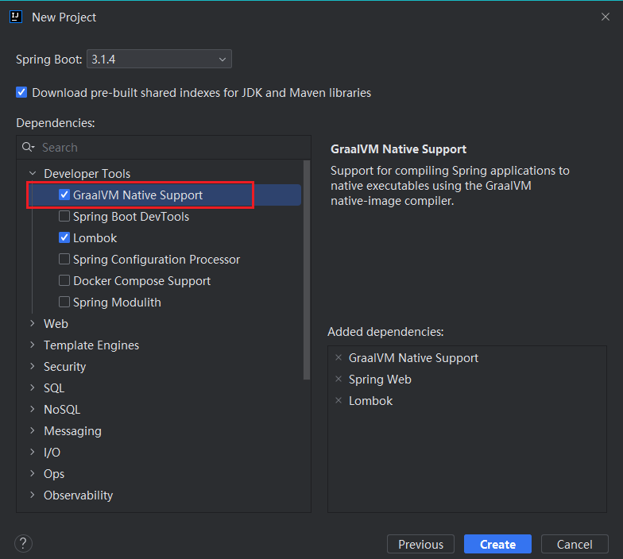
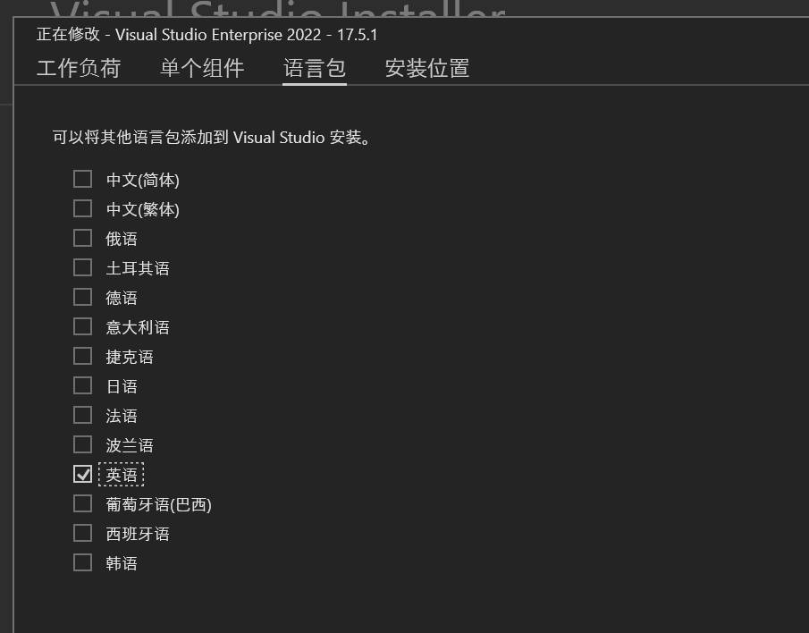
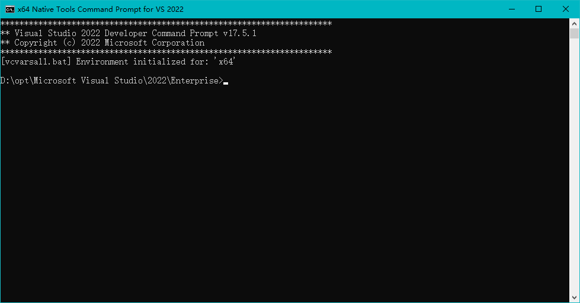

尝试 Spring Native，将一个 SpringBoot3 项目编译为二进制文件，提升程序启动速度

<!-- truncate -->

> 相关链接：
>
> [GraalVM](https://www.graalvm.org/)
>
> [GraalVM Native Image Support](https://docs.spring.io/spring-boot/docs/current/reference/html/native-image.html)
>
> 使用版本：
>
> GraalVM:  graalvm-jdk-17.0.8+9.1
>
> spring-boot: 3.1.4
>
> native-maven-plugin: 0.9.27
>
> 注意：此文章于 2023-10-19 完成，可能已经过时

## Native Image 的优缺点

优点：

- 程序启动时间段
- 运行时使用内存少
- 运行环境不需要安装 jvm

缺点：

- 编译时间长
- 部分依赖不支持（或需要进行特殊配置）
- 需要生成提示文件来支持反射等功能
- 生成的二进制文件较大

## GraalVM

在下载页面，选择对应的 Java 版本和平台，下载对应的 GraalVM（这里以 Java 17 与 Windows 平台为例）



下载后，自行解压、配置环境变量 `JAVA_HOME`，将 `$JAVA_HOME/bin` 加到 `PATH` 中

## 项目

### 创建项目

选择 JDK 为 graalvm



选择 GraalVM Native Support，创建项目（会添加 `native-maven-plugin` 到 `pom.xml`）

这里我额外选择了 Spring Web 和 Lombok，来写一个接口用于测试



### 编写代码（用于测试）

修改 NativeDemoApplication，编写测试接口

```java
@RestController
@SpringBootApplication
public class NativeDemoApplication {
    
    @GetMapping
    public String hello() {
        return "Hello World!";
    }
    
    public static void main(String[] args) {
        SpringApplication.run(NativeDemoApplication.class, args);
    }
    
}
```

直接运行程序后，请求接口正常，接下来将项目编译为二进制文件

## 编译环境

### Linux

以 Debian 为例，执行下面的命令安装所需的包（一般服务器中都有），其他发行版可参考[文档](https://www.graalvm.org/latest/reference-manual/native-image/#linux)

```sh
sudo apt-get install build-essential zlib1g-dev
```

### Windows

在 Windows 上进行编译，需要额外安装 Visual Studio（至少 Visual Studio 2022），并配置相关环境变量，详细操作可参考 [Using GraalVM and Native Image on Windows](https://medium.com/graalvm/using-graalvm-and-native-image-on-windows-10-9954dc071311)

另外需在 VS 附带的 `x64 Native Tools Command Prompt for VS 2022` 窗口中执行编译命令（貌似是因为编译命令过长，在 powershell 或 cmd 中执行会出现问题）

#### Visual Studio

自行从[官网](https://visualstudio.microsoft.com/zh-hans/vs/)下载安装，安装时注意，语言包只勾选英语，否则会导致编译时检查环境出错



接下来配置环境变量，以下配置以 VS 安装在 `D:\opt` 为例，需替换为自己 VS 安装路径，注意版本号可能不同

- Path

    添加下列内容

    ```text
    D:\opt\Microsoft Visual Studio\2022\Enterprise\VC\Tools\MSVC\14.35.32215\bin\Hostx64\x64
    ```

- INCLUDE

    新增此环境变量，内容如下

    ```text
    D:\opt\Microsoft Visual Studio\2022\Enterprise\VC\Tools\MSVC\14.35.32215\include
    D:\Windows Kits\10\Include\10.0.22000.0\shared
    D:\Windows Kits\10\Include\10.0.22000.0\ucrt
    D:\Windows Kits\10\Include\10.0.22000.0\um
    D:\Windows Kits\10\Include\10.0.22000.0\winrt
    ```

- LIB

    新增此环境变量，内容如下

    ```text
    D:\opt\Microsoft Visual Studio\2022\Enterprise\VC\Tools\MSVC\14.35.32215\lib\x64
    D:\Windows Kits\10\Lib\10.0.22000.0\um\x64
    D:\Windows Kits\10\Lib\10.0.22000.0\ucrt\x64
    ```

#### 命令行窗口

执行编译命令，需在 `x64 Native Tools Command Prompt for VS 2022` 窗口中进行（可通过 `Win+S` 搜索打开）



## 编译

> 编译耗时较长，同时需要较高内存，建议在性能好的机器上进行

cd 到项目目录中，执行下面的命令进行编译，会由 GraalVM 的 Maven 插件 `org.graalvm.buildtools.native-maven-plugin` 来执行若干处理，并调用 `native-image` 进行编译

```sh
mvn -Pnative native:compile
```

等待编译完成，在生成的 target 目录下，可以找到 `native-demo.exe`（Windows）或 `native-demo`（Linux）可执行文件

执行可执行文件后，请求测试接口，功能正常

## 编译参数

可在 `pom.xml` 中追加 `native-image` 编译时的参数，如：

```xml
<plugin>
    <groupId>org.graalvm.buildtools</groupId>
    <artifactId>native-maven-plugin</artifactId>
    <configuration>
        <buildArgs combine.children="append">
            <buildArg>--enable-url-protocols=http</buildArg>
            <buildArg>--features=xxx.xxx.LambdaRegistrationFeature</buildArg>
            <buildArg>-H:+AllowDeprecatedBuilderClassesOnImageClasspath</buildArg>
            <buildArg>-H:DeadlockWatchdogInterval=10</buildArg>
            <buildArg>-H:-DeadlockWatchdogExitOnTimeout</buildArg>
            <buildArg>-H:+AddAllCharsets</buildArg>
            <buildArg>-H:IncludeResourceBundles=javax.xml.bind.helpers.Messages</buildArg>
        </buildArgs>
    </configuration>
</plugin>
```

- `--enable-url-protocols=http`

  允许程序使用 `http` 协议的 URL
- `--features=xxx.xxx.LambdaRegistrationFeature`

  见 [mybatis-plus](#mybatis-plus)
- `-H:+AllowDeprecatedBuilderClassesOnImageClasspath`
- `-H:DeadlockWatchdogInterval=10`
- `-H:-DeadlockWatchdogExitOnTimeout`

  根据报错提示加入
- `-H:+AddAllCharsets`

  添加对所有字符集的支持
- `-H:IncludeResourceBundles=javax.xml.bind.helpers.Messages`

  包含 `javax.xml.bind.helpers.Messages` 资源包

## 依赖问题

### mybatis-plus

> 参考 [mybatis-native-demo](https://github.com/nieqiurong/mybatis-native-demo) 项目

`pom.xml` 中需添加 `graal-sdk` 依赖，版本号与之前下载的 GraalVM 一致

```xml
<!-- graalvm -->
<dependency>
    <groupId>org.graalvm.sdk</groupId>
    <artifactId>graal-sdk</artifactId>
    <version>23.0.1</version>
</dependency>
```

从 [mybatis-native-demo](https://github.com/nieqiurong/mybatis-native-demo) 项目中复制 MyBatisNativeConfiguration 类，在其 `registerHints` 方法中添加下面的代码，将各 `mapper.xml` 文件注册进提示文件，其中 `mapper/**/*.xml` 是各 `mapper.xml` 文件的位置

```java
Stream.of("mapper/**/*.xml").forEach(hints.resources()::registerPattern);
```

从 [mybatis-native-demo](https://github.com/nieqiurong/mybatis-native-demo) 项目中复制下面的三个类

- `GraalReflectionAotHints`
  注解，在使用了 mybatis-plus lambda 方法的类上标记
- `AotUtils`
  获取所有标记了 `GraalReflectionAotHints` 注解的类
- `LambdaRegistrationFeature`
  将 `AotUtils` 获取的所有类调用 `RuntimeSerialization::registerLambdaCapturingClass` 方法注册进去

使用 `GraalReflectionAotHints` 注解标记需要注册的类

给 `native-maven-plugin` 添加下面的 buildArg

```xml
<buildArg>--features=xxx.xxx.LambdaRegistrationFeature</buildArg>
```

### ShardingSphere-jdbc

修改配置文件的分表规则写法（native-image 不支持 Groovy）：

```yaml
actualDataNodes: ds0.t_test_$->{0..1}
# 改写为
actualDataNodes: <LITERAL>ds0.t_test_0, ds0.t_test_1
```

### fastjson

使用类似于 `JSON.to(clazz, obj)` 的方法会产生报错 `org.graalvm.nativeimage.MissingReflectionRegistrationError`

需要自行将对应的 clazz 添加到提示文件中，可以使用 [custom hints](https://docs.spring.io/spring-boot/reference/packaging/native-image/advanced-topics.html#packaging.native-image.advanced.custom-hints) 中提到的 `@RegisterReflectionForBinding` 注解，在任意位置（使用到对应 clazz 的方法/类，自己编写的配置类，XXXApplication 等都可以）添加该注解，在注解参数中填入需要注册的 clazz 即可，如：

```java
import org.springframework.aot.hint.annotation.RegisterReflectionForBinding;
import org.springframework.context.annotation.Configuration;

@Configuration(proxyBeanMethods = false)
@RegisterReflectionForBinding({
        Foo.class,
        Bar.class
})
public class NativeConfiguration {
}
```

## 提示文件

部分涉及到反射的依赖或程序代码，可以通过生成提示文件的方法来解决

> 相关链接：
>
> [Reachability Metadata](https://www.graalvm.org/latest/reference-manual/native-image/metadata/)
>
> [Collect Metadata with the Tracing Agent](https://www.graalvm.org/22.3/reference-manual/native-image/metadata/AutomaticMetadataCollection/)
>
> [aot](https://docs.spring.io/spring-framework/reference/core/aot.html)
>
> [Using the Tracing Agent](https://docs.spring.io/spring-boot/docs/current/reference/html/native-image.html#native-image.advanced.using-the-tracing-agent)
>
> [Custom Hints](https://docs.spring.io/spring-boot/docs/current/reference/html/native-image.html#native-image.advanced.custom-hints)

在 `src/main/resources/META-INF/native-image/` 目录下的提示文件会在编译时被使用，提示文件的类型和作用参考 [Metadata Types](https://www.graalvm.org/latest/reference-manual/native-image/metadata/#metadata-types)

生成提示文件的方法主要有以下两种：

- 自定义提示
- Tracing Agent

### 自定义提示

> [aot](https://docs.spring.io/spring-framework/reference/core/aot.html)
>
> [Runtime Hints](https://docs.spring.io/spring-framework/reference/core/aot.html#aot.hints)

Spring Native 在编译之前会对 jar 包进行 aot 处理，在 `META-INF/native-image/<group.id>/<artifact.id>` 目录生成提示文件

可以自定义一个实现 `RuntimeHintsRegistrar` 接口的类来注册需要加入提示文件的内容

RuntimeHints 类的写法如下，需要在 Bean 上使用 `@ImportRuntimeHints` 注解来导入：

```java
import java.lang.reflect.Method;

import org.springframework.aot.hint.ExecutableMode;
import org.springframework.aot.hint.RuntimeHints;
import org.springframework.aot.hint.RuntimeHintsRegistrar;
import org.springframework.util.ReflectionUtils;

public class MyRuntimeHints implements RuntimeHintsRegistrar {

    @Override
    public void registerHints(RuntimeHints hints, ClassLoader classLoader) {
        // Register method for reflection
        Method method = ReflectionUtils.findMethod(MyClass.class, "sayHello", String.class);
        hints.reflection().registerMethod(method, ExecutableMode.INVOKE);

        // Register resources
        hints.resources().registerPattern("my-resource.txt");

        // Register serialization
        hints.serialization().registerType(MySerializableClass.class);

        // Register proxy
        hints.proxies().registerJdkProxy(MyInterface.class);
    }

}
```

一般可以将 RuntimeHints 类的定义和导入写在一起，如：

```java
@Configuration(proxyBeanMethods = false)
@ImportRuntimeHints(MyBatisNativeConfiguration.MyBaitsRuntimeHintsRegistrar.class)
public class MyBatisNativeConfiguration {
    
    static class MyBaitsRuntimeHintsRegistrar implements RuntimeHintsRegistrar {

        @Override
        public void registerHints(RuntimeHints hints, ClassLoader classLoader) {
            // ...
        }
    }
}
```

还可以直接使用 `@RegisterReflectionForBinding` 注解来绑定需要序列化和反序列化的类

此注解可以在任何 bean 的类或方法上使用，绑定参数中的类，使用方法如：

```java
@Component
public class OrderService {

    @RegisterReflectionForBinding(Account.class)
    public void process(Order order) {
        // ...
    }

}
```

或在一处绑定多个类：

```java
@Configuration(proxyBeanMethods = false)
@RegisterReflectionForBinding({
    UserVO.class,
    OrderVO.class,
    UserDTO.class,
    OrderDTO.class,
})
public class MyReflectionBindingConfiguration {
}
```

### Tracing Agent

> [Tracing Agent](https://www.graalvm.org/22.3/reference-manual/native-image/metadata/AutomaticMetadataCollection/#tracing-agent)

将项目打成 jar 包之后，使用 graalvm 执行下面的命令来运行程序

```sh
java -agentlib:native-image-agent=config-output-dir=/path/output -jar xxx.jar
```

当程序停止后，会在 `/path/output` 目录生成提示文件，将文件放到项目的 `src/main/resources/META-INF/native-image/` 目录下即可

提示文件中会记录本次运行中用到的反射、序列化与反序列化、资源文件等内容，所以在程序运行时需要尽可能完整地使用每一处功能逻辑

如果一次运行还不够的话，可以使用下面的命令来继续生成提示文件（会在已有的提示文件基础上，继续增加新的内容）

```sh
java -agentlib:native-image-agent=config-merge-dir=/path/output -jar xxx.jar
```
