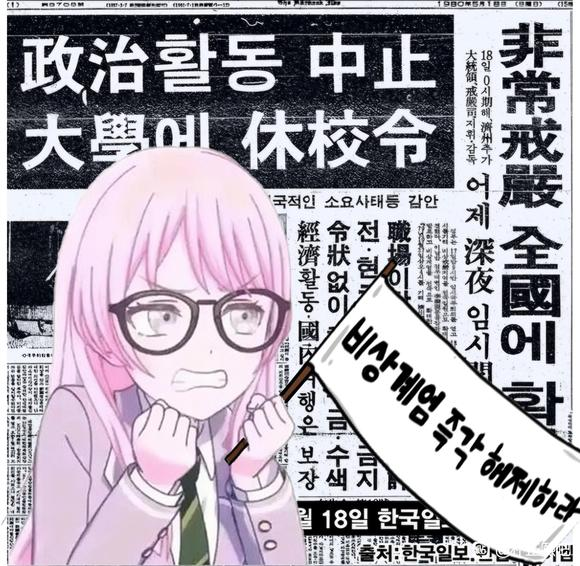

昨天睡前刷贴吧，看到了朴吧的一个帖子：[开帖讲讲guilliman对战团的革新](https://tieba.baidu.com/p/9196920829)，用战锤40K的名词作为黑话，很有意思

<!--more-->

## 背景

### 朴吧

朴吧全名朴正熙吧，看名字就知道，最初是讨论五共的，后来逐渐变成了一个鉴证贴吧，具体情况可以看B站的视频：[幽默鉴证人，赛博科米国-朴正熙吧发生了什么？-中文互联网上定型文的圣地](https://www.bilibili.com/video/BV1XE421P7WV/)，讲的还不错

我接触朴吧比较晚，当时吧头已经换成了 anon，讨论的内容也以“疯狂的网左”为主

前段时间，朴吧举行了[吧头像投票](https://tieba.baidu.com/p/9120348028)，之后又因为审核问题，最终将吧头从 anon 换成了 tomori（感觉不如 anon 的那个）

### 映射

因为贴吧的审核比较严格，各个鉴证贴吧都会用一些黑话来指代某人，比如用代号、特征、谐音等等

最近一段时间，开始有人用艺术作品里的人物和故事情节来映射现实中的人物和事件，比如战锤40K、mygo、果宝特攻等等

其中战锤40K的映射感觉最受欢迎，即使我甚至没了解过战锤，只看过一些相关的 meme，也能很容易理解，而且确实很好玩

现在也多出了一批用战锤叙事来讲解前些年各种事件的帖子，比之前到处都是“疯狂的网左”贴要好多了

## 摘录

[原帖](https://tieba.baidu.com/p/9196920829)较长，这里不摘录了，主要讲的貌似是被称为极限建军的事件，感觉讲的还行

引用一下原帖261楼的评论，对映射关系有做详细解释：

> 讲的很好，我支持你们啊，不过☁️的太差很多引喻失义了，建议好好学学密码本，顺便简简单单给页u讲点一般情况下的通解自己领会
> 
> 帝皇:领导了泰拉统一战争，阿斯塔特军团和人类帝国的缔造者，人类帝国ysxt帝国真理的创造者，现坐于黄金王座保持万年不变
> 
> 基里曼:现帝国摄政，大力整顿帝国内政，创建新军，大造舰队，重振帝国真理
> 
> 混沌:人类帝国一直以来最大的敌人，从未停止对帝国的亚空间污染，包括色孽奸奇恐虐纳垢，基里曼曾领导帝国进行了3年对抗纳垢的瘟疫战争
> 
> 帝国暗面:由于混沌影响从帝国分裂出去，无法被星炬照耀的地方（反之为帝国圣疆），基里曼意在发起的不屈远征目标便是收复帝国暗面
> 
> 艾达灵族:北方星域的种族，曾经有着强大的统一政权和辉煌的历史，由于各种原因灵族帝国在多年前分裂，然而原灵族帝国的遗产仍然丰富足以支撑起起主要继承者方舟灵族在银河中有一席之地，受混沌影响的黑暗灵族（黑豆芽）正在和方舟灵族（白豆芽）开战
>
> 钛帝国:有着根深蒂固的种姓制度，和帝国长期存在边境冲突。凶险的宇宙天堑达摩克利斯湾隔离了帝国和钛族人，多年前钛帝国曾自向帝国方向进行扩张并遭到了帝国军队痛击
>
> 绿皮兽人:繁殖能力极强，广泛存在于银河系各处，狂热信仰搞毛二神，极具破坏力，对帝国和混沌方都进行过袭击，以至于甚至在一段时期里帝国与混沌曾为打击绿皮势力而短暂和解

