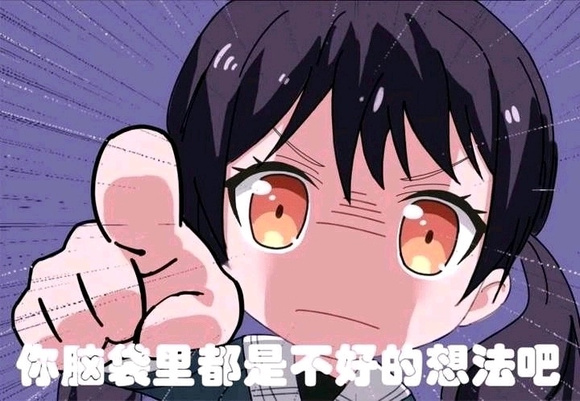
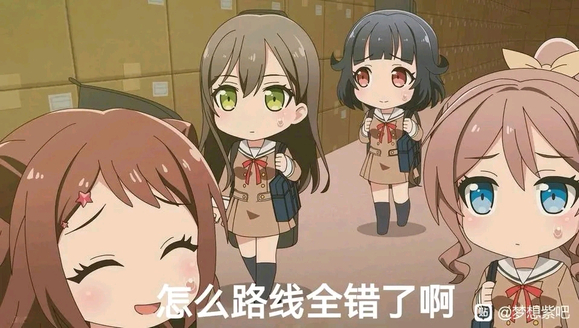
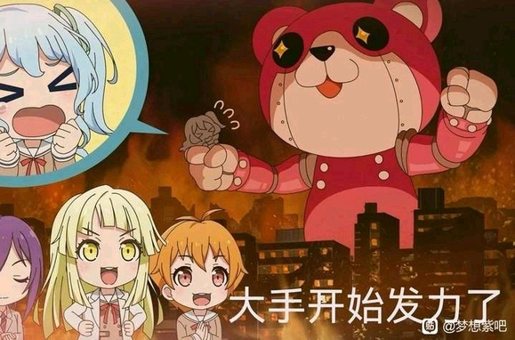

记录最近几天刷朴吧，看到的一些有意思的内容

<!--more-->

## 背景

### 朴吧

朴吧全名朴正熙吧，看名字就知道，最初是讨论五共的，后来逐渐变成了一个鉴证贴吧，具体情况可以看B站的视频：[幽默鉴证人，赛博科米国-朴正熙吧发生了什么？-中文互联网上定型文的圣地](https://www.bilibili.com/video/BV1XE421P7WV/)，讲的还不错

我接触朴吧比较晚，当时吧头已经换成了 anon，讨论的内容也以“疯狂的网左”为主

前段时间，朴吧举行了[吧头像投票](https://tieba.baidu.com/p/9120348028)，之后又因为审核问题，最终将吧头从 anon 换成了 tomori（感觉不如 anon 的那个）

国庆假期闲来无事，就刷了很多朴吧的帖子，正好遇上朴吧涌现出一批有趣的帖子，迎来热度猛增的时期

10月9号，朴吧发布[非常戒烟令扩大通知](https://tieba.baidu.com/p/9211868424)

### 黑话

因为贴吧的审核比较严格，各个鉴证贴吧都会用一些黑话来指代某人，比如用代号、特征、谐音等等

最近一段时间，开始有人用艺术作品里的人物和故事情节来映射现实中的人物和事件，比如mygo、战锤40K，甚至果宝特攻等等

## 战锤

在这篇文章刚开始写的时候（尚在国庆假期），我睡前看了一个名为[开帖讲讲guilliman对战团的革新](https://tieba.baidu.com/p/9196920829)的帖子，里面使用战锤40K的人物和设定来指代现实，讲解了极限建军的经过，很有意思

虽然我不了解政治和历史，但粗略看下来感觉讲的还行，而且尝试理解黑话的过程也挺有意思的，有一种解谜的乐趣，即使像我一样不了解战锤，也能看得津津有味

引用一下原帖261楼的评论，对映射关系有做详细解释：

> 讲的很好，我支持你们啊，不过☁️的太差很多引喻失义了，建议好好学学密码本，顺便简简单单给页u讲点一般情况下的通解自己领会
> 
> 帝皇:领导了泰拉统一战争，阿斯塔特军团和人类帝国的缔造者，人类帝国ysxt帝国真理的创造者，现坐于黄金王座保持万年不变
> 
> 基里曼:现帝国摄政，大力整顿帝国内政，创建新军，大造舰队，重振帝国真理
> 
> 混沌:人类帝国一直以来最大的敌人，从未停止对帝国的亚空间污染，包括色孽奸奇恐虐纳垢，基里曼曾领导帝国进行了3年对抗纳垢的瘟疫战争
> 
> 帝国暗面:由于混沌影响从帝国分裂出去，无法被星炬照耀的地方（反之为帝国圣疆），基里曼意在发起的不屈远征目标便是收复帝国暗面
> 
> 艾达灵族:北方星域的种族，曾经有着强大的统一政权和辉煌的历史，由于各种原因灵族帝国在多年前分裂，然而原灵族帝国的遗产仍然丰富足以支撑起起主要继承者方舟灵族在银河中有一席之地，受混沌影响的黑暗灵族（黑豆芽）正在和方舟灵族（白豆芽）开战
>
> 钛帝国:有着根深蒂固的种姓制度，和帝国长期存在边境冲突。凶险的宇宙天堑达摩克利斯湾隔离了帝国和钛族人，多年前钛帝国曾自向帝国方向进行扩张并遭到了帝国军队痛击
>
> 绿皮兽人:繁殖能力极强，广泛存在于银河系各处，狂热信仰搞毛二神，极具破坏力，对帝国和混沌方都进行过袭击，以至于甚至在一段时期里帝国与混沌曾为打击绿皮势力而短暂和解

## 邦邦

除了上面那个帖子，朴吧还有很多其他帖子用战锤叙事来进行讨论，不过战锤应该不是最早的皮套，在我关注了但没怎么看朴吧的那段时间，朴吧最流行的大概是 mygo，即使到现在，也有很多帖子用 mygo 作为密码本，偶尔也会用到一部分邦邦的内容

比如最常见的，将 mygo 的五人对应现实中的五个人（不过实际上经常使用的只有四个）：

乐奈最容易理解，毕竟猫的属性还是很明显的，灯和立希是取其名字中某字的谐音，爱音则是其戴的眼镜，至于 soyo，就只能用排除法了，而且一般除了部分特定话题，也没有人会提及

话说邦邦和鉴证的重合度未免有些太高了，早在我入坑邦邦之前，就经常能在贴吧刷到很多 [pico](https://www.bilibili.com/bangumi/play/ep249942) 表情包，其中就有相当一部分和鉴证有关系，可能是和喜羊羊的鉴证图是同一时期制作的

## 5t5

在朴吧戒烟令发布之前，战锤密码本之后，中间又兴起了使用五条悟作为皮套的热潮，取其名字中的数字，以及历史最强与当代最强的比喻

同时也借用了很多咒术回战中的设定，像是什么最强咒术师（应该类似于乐队指挥）、高专、中专什么的，不过我没看过漫画和动画，不了解

## 最后

几轮皮套看下来，感觉朴吧确实如其他贴吧所说的一样，几乎都是理智的兔友

对于我来说，观点不会太过极端，产出的内容也足够有趣，甚至其中还有来自 lofter 的（[法式小面包](https://fengyi77155.lofter.com/post/31f30ba1_2bcd489bd)）
